

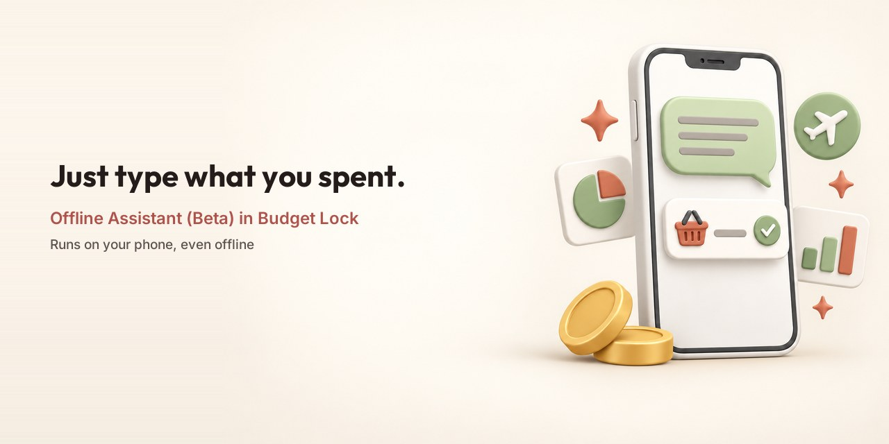

# Budget Lock Assistant

**The file that lets Budget Lock's assistant understand what you type, on your own phone or PC.**

[Download page](https://budgetlock.app/model) · [Website](https://budgetlock.app) · [Licence and credits](https://budgetlock.app/model-license.html) · [Assistant terms](https://budgetlock.app/model-terms.html)

---

## Contents

- [What it does](#what-it-does)
- [Download](#download)
- [Add it to the app](#add-it-to-the-app)
- [Privacy](#privacy)
- [Space and phones](#space-and-phones)
- [About Budget Lock](#about-budget-lock)
- [More apps by AAS Codeworks](#more-apps-by-aas-codeworks)
- [Licence and credits](#licence-and-credits)
- [Contact](#contact)

This page holds the assistant file's downloads and a few help pages. The Budget
Lock app itself is not here.

## What it does

Type a sentence the way you would say it:

| You type | Budget Lock |
|---|---|
| *spent 450 on groceries at the supermarket* | adds the expense, and asks if it needs anything else, such as the account |
| *what did I spend on food last month?* | answers from your own records |

The assistant is in **beta**: it starts switched off, and while you try it,
every change it makes asks you first. It uses an AI model and sometimes gets
things wrong. Check what it did; Undo reverses a change.

Without the file, the assistant works in simple mode and understands simple
sentences only.

## Download

| Version | Size | Released | Works with |
|---|---|---|---|
| **6 (current)** | 478 MB | 15 Sep 2026 | Budget Lock 1.7.2 or newer on Android, and Budget Lock for Windows |

**[Download version 6](https://github.com/aascodeworks/budgetlock-assistant/releases/download/v6/BudgetLock-Assistant-v6.gguf)** ·
[all versions](CHANGELOG.md) ·
[check the file yourself](docs/verify-the-file.md)

**Sharing a link?** Use one of these. They always lead to the right file, even
if it moves:

- `https://budgetlock.app/model`, the page with the steps
- `https://budgetlock.app/download/assistant`, the newest file

## Add it to the app

**First, turn it on:** after the update, Budget Lock offers the assistant once; tap
**Turn it on**. Or turn it on any time in **Settings → Offline Assistant**.

**Easiest:** open **Assistant** and tap **Download it here**.
Budget Lock downloads the file, checks it and sets it up. If the connection
drops, it carries on where it stopped.

**Or do it yourself:**

1. Download the file on your phone. It goes to **Downloads**.
2. In Budget Lock, open **Assistant** and choose *I downloaded it from budgetlock.app*.
3. Tap **Choose the file** and pick the file.
4. Budget Lock checks it and keeps its own copy. You can delete the one in Downloads.

**On Windows:** put the file in the app's `models` folder.

Something went wrong? [docs/add-the-file.md](docs/add-the-file.md) explains each
message in the app.

## Privacy

- The assistant runs on your phone or PC.
- The app goes online for it only when you tap *Download it here*, to fetch this
  file. The download starts on budgetlock.app and comes from GitHub. The
  [Privacy Policy](https://budgetlock.app/privacy-policy.html) has the details.

## Space and phones

- **Space:** about 1 GB free while you add it, 478 MB after.
- **Phones:** most Android phones from the last few years. If yours can't run
  it, the app tells you.
- **Remove it any time:** Settings → Offline Assistant → *Remove the assistant
  file*. The assistant goes back to simple mode.

## About Budget Lock

A personal finance app that keeps your records encrypted on your own device.

<table>
  <tr>
    <td>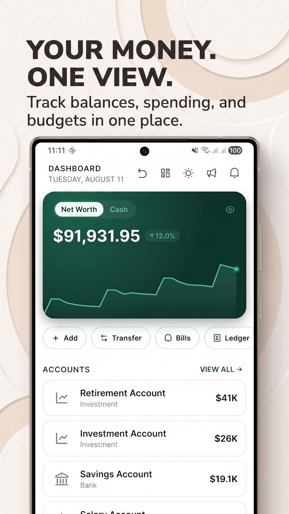</td>
    <td>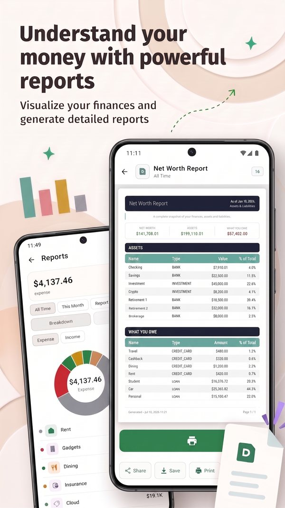</td>
    <td>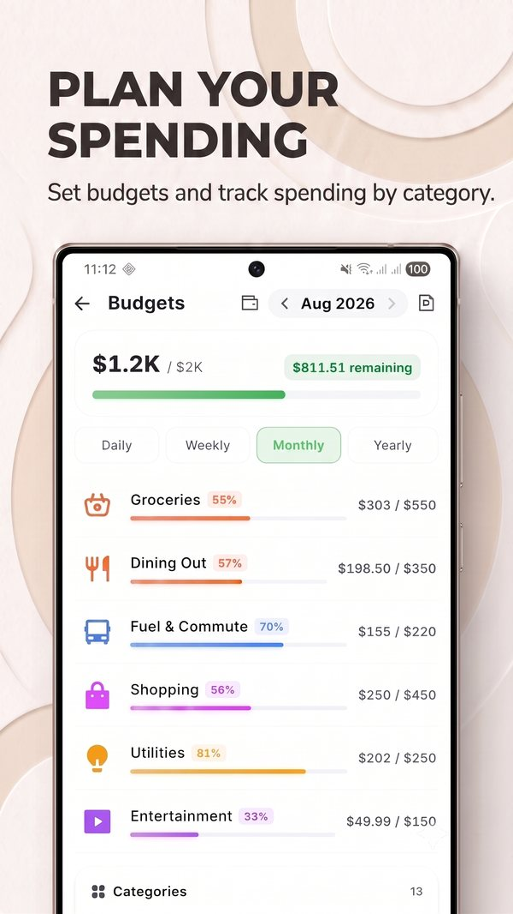</td>
    <td>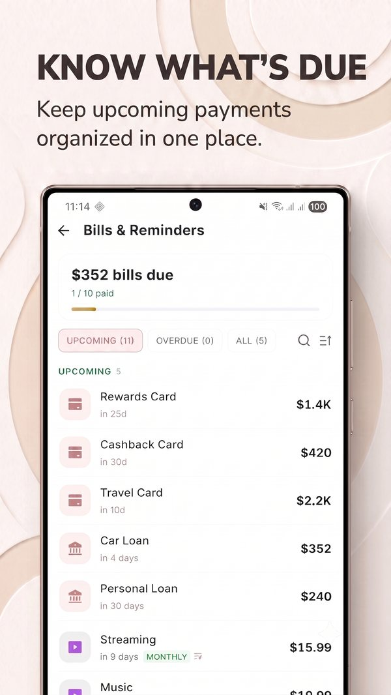</td>
  </tr>
  <tr>
    <td>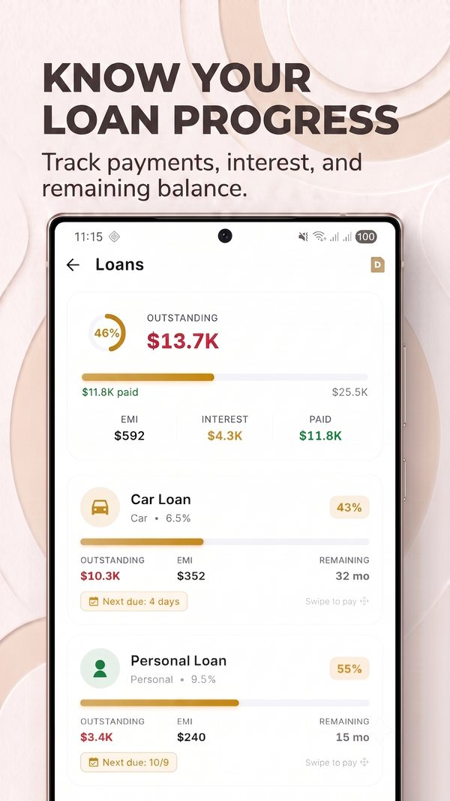</td>
    <td>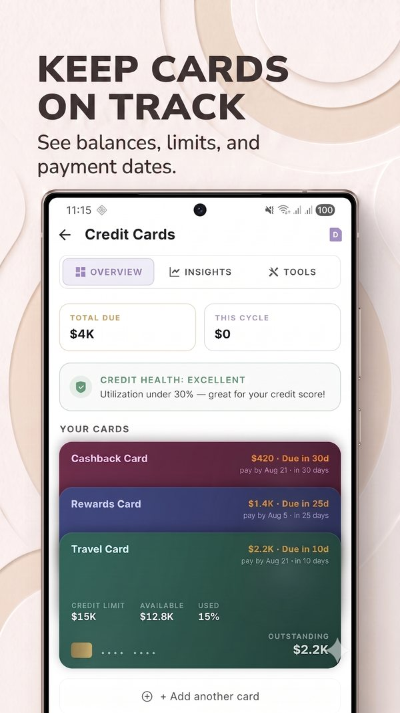</td>
    <td>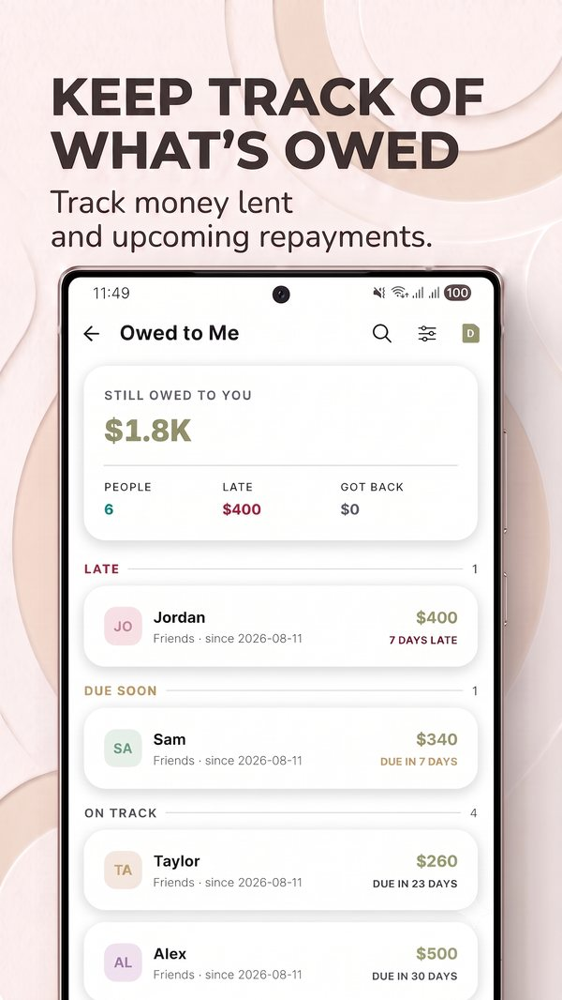</td>
    <td>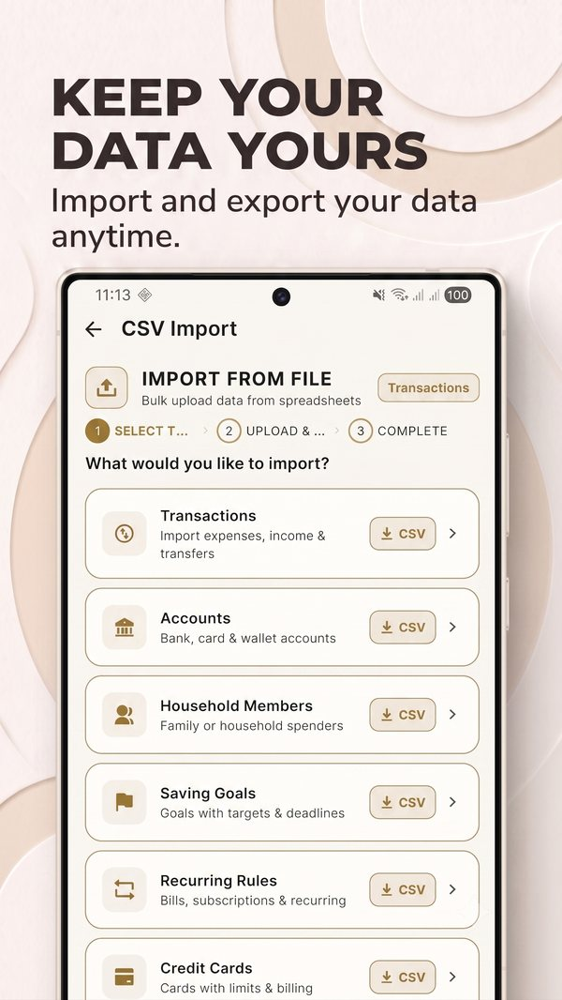</td>
  </tr>
</table>

- **Accounts, budgets and bills:** every balance on one screen, budgets that warn
  you before you overspend, bills, EMIs and recurring payments.
- **Loans and cards:** interest, principal and payoff date; billed and unbilled
  card spending kept apart.
- **Goals and lending:** savings goals with a deadline, money you lent and money
  you owe.
- **Private by design:** AES-256 encryption on your device, works offline, no
  Budget Lock account to create.
- **Yours to take out:** export your data any time.
- **50 languages, 50+ currencies.**

## More apps by AAS Codeworks

| | App | What it is | Link |
|---|---|---|---|
| 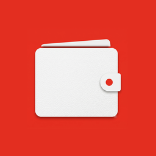 | **Budget Lock** | Encrypted budget app and expense tracker for Android | [Google Play](https://play.google.com/store/apps/details?id=com.budgeting365.app) |
|  | **Budget Lock for Windows** | Budget Lock on Windows 10 and 11 | [budgetlock.app/windows](https://budgetlock.app/windows.html) |
| 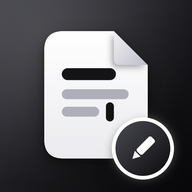 | **NoteDraft — Offline Notepad** | Private offline notepad for notes, Markdown, to-do checklists and maps | [Google Play](https://play.google.com/store/apps/details?id=app.notedraft.noteall) |

## Licence and credits

The assistant file is based on **Qwen3.5-0.8B** by Alibaba Cloud's Qwen team and
is shared under the Apache License 2.0. AAS Codeworks trained it on Budget Lock's
own example sentences and made it small enough for phones.

- [Licence and credits](https://budgetlock.app/model-license.html), in plain words
- [Assistant terms](https://budgetlock.app/model-terms.html)
- Full texts: [LICENSE](LICENSE) and [NOTICE](NOTICE)

The licence covers the assistant file. The Budget Lock app is not open source.
Qwen is a trademark of its owner and is named here only to credit the base model.

## Contact

- Help with the app or the file: **support@budgetlock.app**
- A security problem: see [SECURITY.md](SECURITY.md)
- Like the app? A rating on [Google Play](https://play.google.com/store/apps/details?id=com.budgeting365.app)
  helps other people find it.

© 2025–2026 AAS Codeworks · Google Play and the Google Play logo are trademarks of Google LLC.

